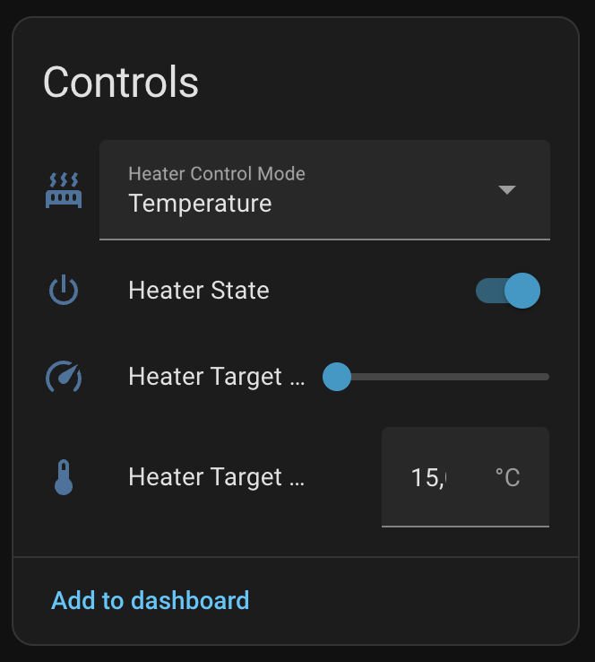
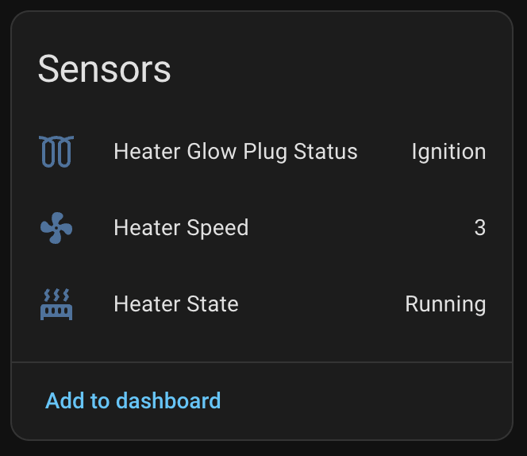
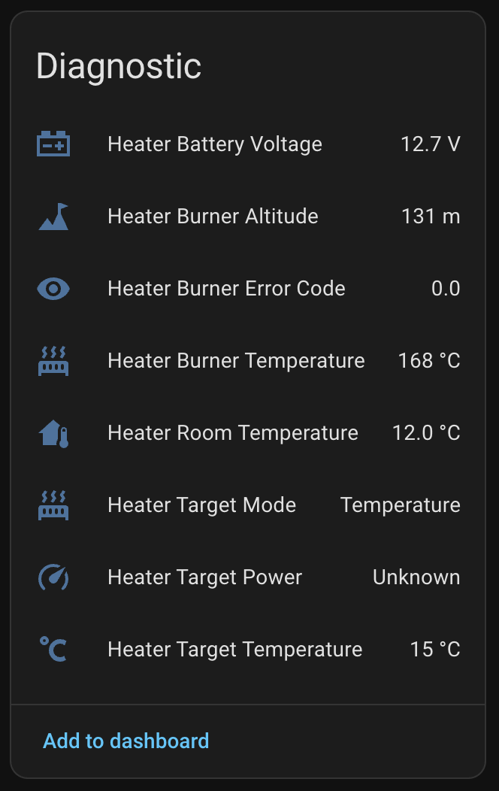

# Vevor Diesel Heater – ESPHome Package

## Hardware overview

- **Board**: ESP32 with bluetooth (e.g., [M5Stack Atom](https://m5stack.com/products/atom-lite-esp32-development-kit))
- **Diesel Heater**: [VEVOR Air Diesel Heater 12V 8KW](https://www.vevor.nl/diesel-verwarmer-c_10321/vevor-air-diesel-standkachel-12v-8kw-luchtverwarmer-air-diesel-diesel-standkachel-luchtverwarmer-0-16-0-62-l-uur-dieselkachel-met-lcd-display-afstandsbediening-bluetooth-app-p_010679003839)

## Getting started

1. Install ESPHome (Home Assistant add-on or ESPHome CLI).
2. Create or select a new ESPHome device (e.g., `diesel-heater.yaml`).
3. Flash the device once over USB to enable OTA updates.

## Add the package to your ESPHome config

Your device config can simply include the package from this repository.  
See the example below for the required `packages` and `substitutions` keys.

```yaml
packages:
  base:
    url: https://github.com/CZYK-Solutions/esphome-vevor-diesel-heater-ble
    files: [esphome.yaml]
    # Optional: you can pin to a specific release version if needed
    ref: release/v1

substitutions:
  name: diesel-heater
  friendly_name: Diesel Heater
  
  # The Mac address of your heater's BLE module
  # you can use nRF Connect app to find it
  mac_address: "AA:BB:CC:DD:EE:FF"
```

## What the package includes

The package defined in `esphome.yaml` sets several Controls, Sensors and Diagnostics entities to monitor and control the heater via BLE:

<table>
  <tr>
    <th>Controls</th>
    <th>Sensors</th>
    <th>Diagnostics</th>
  </tr>
  <tr>
    <td valign="top"></td>
    <td valign="top"></td>
    <td valign="top"></td>
  </tr>
</table>

You may further automate and customize the heater using available scripts according to the Interface mentioned below.

## Interface

### Available Scripts

#### `heater_turn_on`

**Description:**

Turn the heater on

**Invocation:**

No parameters required.

#### `heater_turn_off`

**Description:**

Turns the heater off.

**Invocation:**

No parameters required.

#### `heater_set_power`

**Description:**

Sets the desired heating power level as a percentage (0–100%).

**Parameters:**

- `level` _(int)_: The desired power level of the heater, as a percentage. Value must be between 0 (off) and 100 (full power).

#### `heater_set_temperature`

**Description:**

Sets the desired target temperature in °C as float (8.0 - 36.0).

**Parameters:**

- `temperature` _(float)_: The desired target temperature in °C. Value must be between 8.0 and 30.0.


## ⚠️ DISCLAIMER

This project is provided for **educational purposes only**. It is not affiliated with or endorsed by Vevor or any related manufacturers.

By using this configuration, you acknowledge and agree that:

- You are fully responsible for the correct and safe operation of your own hardware.
- Improper configuration or usage **may damage equipment** or lead to **fire hazards or health risks**.
- This software is provided **“as is”, without warranty** of any kind — express or implied.
- You use this at your own risk.

## Thanks
- [iotmaestro/vevor-heater-ble](https://github.com/iotmaestro/vevor-heater-ble) for writing similar projects that inspired this work. 
- [spin877/Bruciatore_BLE](https://github.com/spin877/Bruciatore_BLE) for figuring out the BLE protocol.
